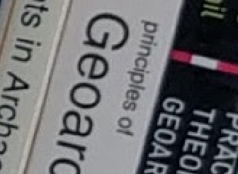
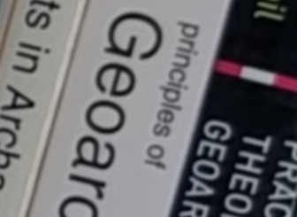

### This is a Linux shell script to create a 'super resolution' image from a stack of lower resolution images.

***

## USAGE:
`./SR.sh`

## DIRECTIONS:
Place this script into a directory containing a sequential series of ".jpg" images of the same scene. Images should be taken hand-held with any image stabilizion off, and with a fast shutter speed to avoid motion blur. They should have been taken in quick succession to avoid changes in lighting conditions or other movements in the scene. At least 8 or 10 images are needed, and probably no more than 20.
Open a terminal in this directory and execute the script with `./SR.sh`. It will create a new subdirectory for the aligned images, and will produce two output "super resolution" images with detail at twice the resolution of the input images. One, `SR_mean.jpg` uses the mean of the image stack to calculate the final pixel values (better luminosity values and potential increase in dynamic range. Chance of "ghosting"if images not perfectly aligned). The other, `SR_median.jpg` will use the median value (better sharpness, perhaps, and less chance of ghosting effects).

## SAMPLE IMAGES:
I've included a small series of sample images so that you can test the script on your system, which can be found in the `sample_images` subdirectory. These are a series of 8 megapixel jpeg images shot with a Nexus 5x Android phone, handheld, using the awesome Open Camera app (FOSS!). The images are of my bookshelf here in my campus office, which offers enough detail to see the difference between the original 8 megapixel versions, and the ~32 megapixel result of the super resolution. You can use these images to experiment with the script, but  here are some results using the default values (shown at a 400% crop):
| **Orignal image** | **Superresolution** |
| :---: | :---: |
|  |  |

## HINTS:
1.  Ensure the script is executable with `chmod 755`.
2.  If you want the script to automatically remove the temporary resized or aligned versions of the images after the script is finished, you can uncomment the last line of the script: `#rmdir -fr resized # remove interm images`. otherwise you can manually delete the directory yourself.
3. I chose default values for `align_image_stack` that seemed to work well with my test images. You may find that you need to alter some of the variables for best results with your own images. I suggest reading about `align_image_stack` [here](http://wiki.panotools.org/Align_image_stack) and [here](http://photo.stackexchange.com/questions/83178/cannot-align-images-with-align-image-stack). In particular, you may need to adjust the number of control points (the number after the `-c` in the `align_image_stack` command)
4. This technique is fairly computationally expensive, so it may take some time. Set it in motion, and then go make a sandwich!

## DEPENDS:
You must have imagemagick and hugin-tools installed. The script invokes `convert` from imagemagick to do the upscaling and image averaging, and `align_image_stack` from hugin-tools to align the hand held images. On *buntu distros, install them with apt: `sudo apt-get install imagemagick hugin-tools` or with your favorite package manager.